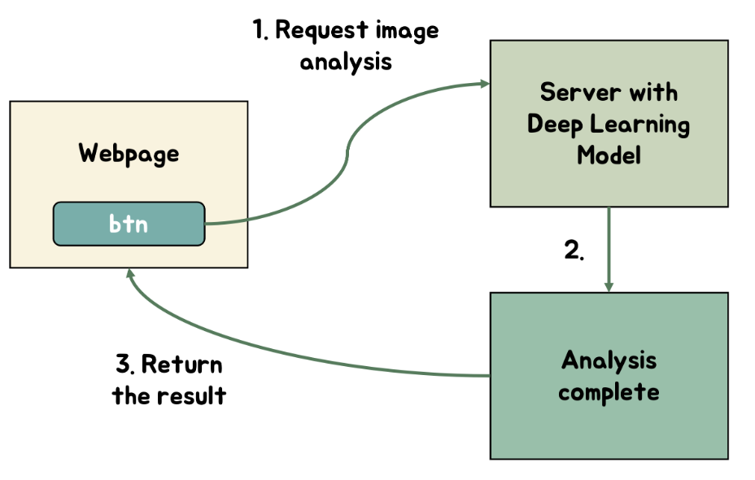

# Architecture

Our main architecture diagram is presented below. Users can upload an x-ray image through our website (https://hiflaskr.herokuapp.com). Once an image is uploaded, the website sends it to the backend, which feeds it into a deep learning model. This model predicts whether the chest image indicates covid-19, tuberculosis, or no symptoms for the patient. Moreover, the model highlights which pixels in the image contributed the most to its decision. By doing so, the user gains insight into the reasoning behind the model's decision, enabling them to make an informed decision if a correction is necessary.

